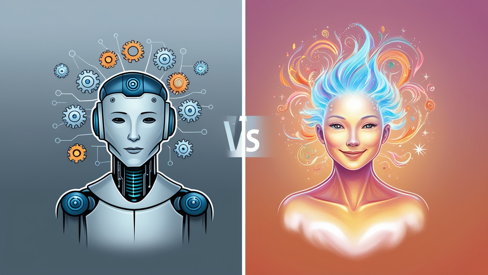
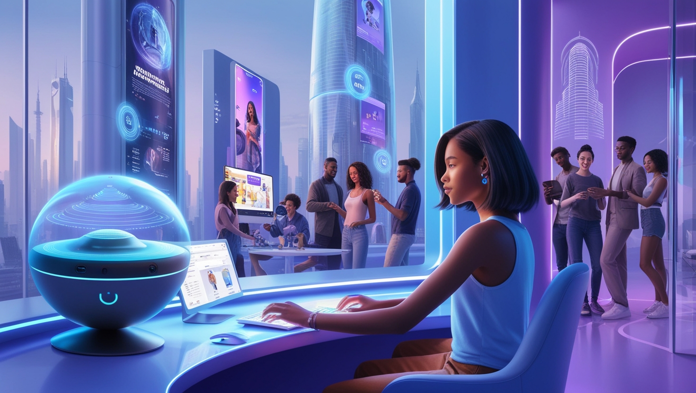
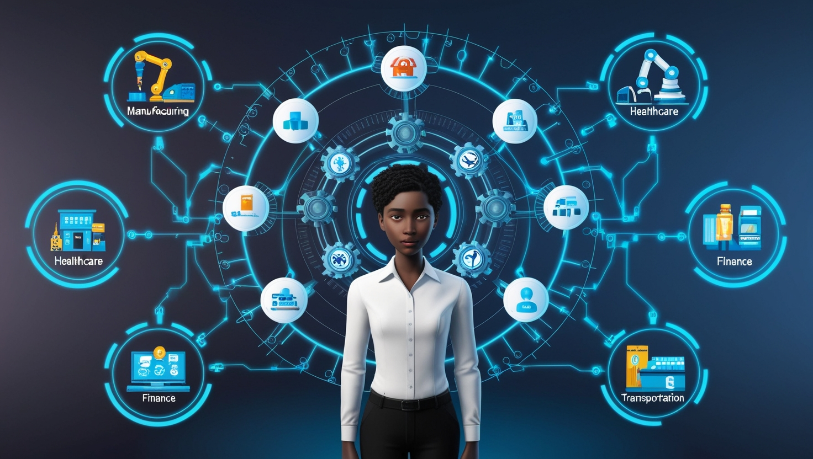
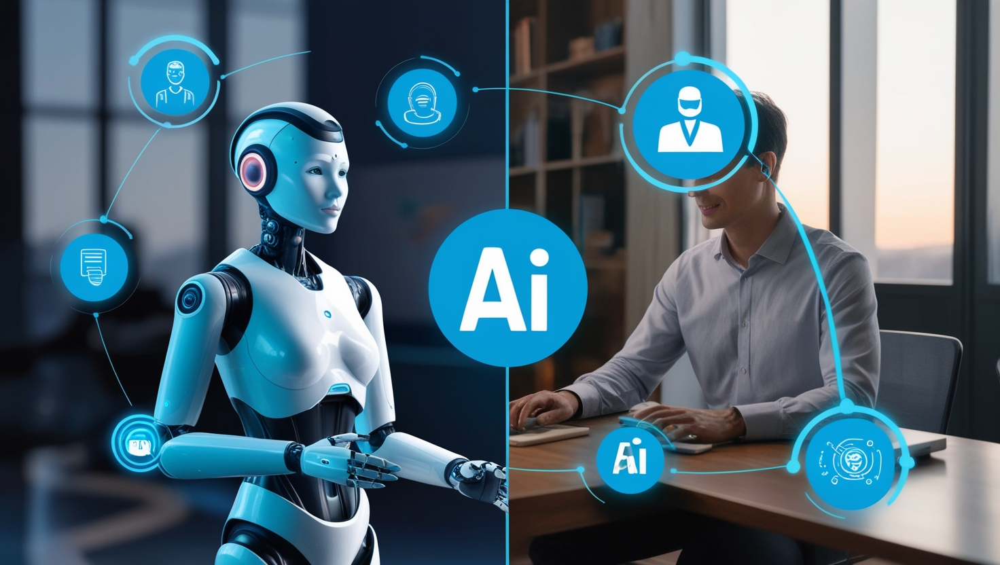
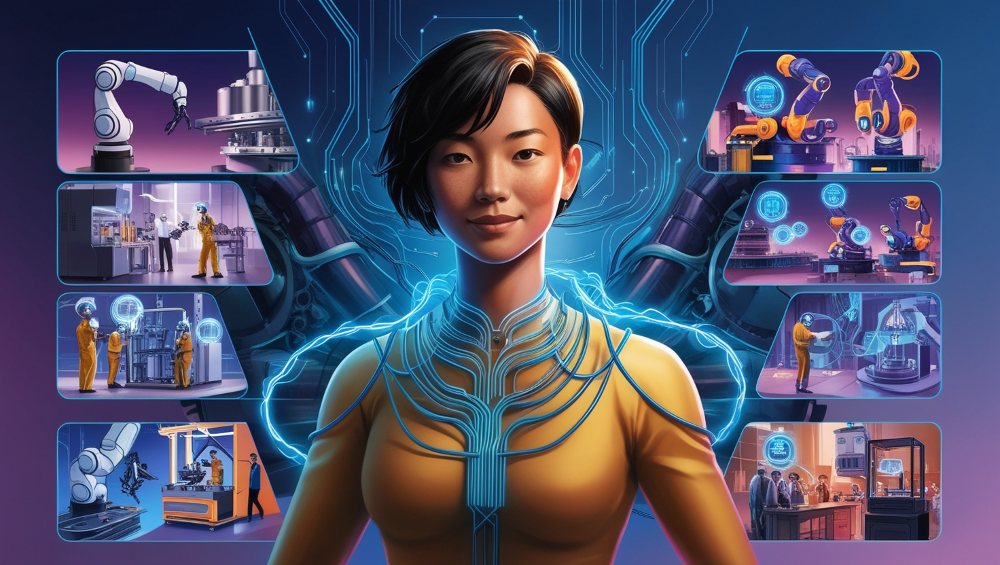

### **E-book: O Impacto das IAs Generativas no Nosso Dia a Dia e no Futuro**

---

#### **Introdução**

O avanço da tecnologia sempre trouxe mudanças significativas para a sociedade, mas nos últimos anos, uma nova revolução tem chamado atenção: **as IAs Generativas**. Essa inovação, que permite criar conteúdos de texto, imagens, sons e até vídeos de maneira autônoma, está rapidamente moldando a forma como vivemos e trabalhamos. Prepare-se para mergulhar no fascinante mundo dessas inteligências e entender como elas influenciam o nosso cotidiano, além de darem pistas sobre o que o futuro nos reserva.

---

### **Capítulo 1: O Que São as IAs Generativas?**

Se você já brincou com um chatbot que parece saber o que você quer dizer antes mesmo de terminar a frase ou viu uma obra de arte gerada por um computador, você já experimentou o poder das IAs generativas. Essencialmente, essas inteligências artificiais são modelos de aprendizado profundo capazes de criar novas informações a partir de dados existentes. 

Ao contrário de outras formas de IA, que apenas analisam ou classificam informações, as IAs generativas **criam algo novo**, como poemas, artigos, soluções de problemas, ou até mesmo esboços de projetos criativos.

*Diagrama ilustrando a diferença entre IAs tradicionais (classificação) e IAs generativas (criação).*

---

### **Capítulo 2: O Cotidiano Sob Influência das IAs Generativas**

Imagina começar o seu dia com um assistente pessoal virtual que não só responde às suas perguntas, mas também cria relatórios de trabalho, organiza sua agenda e até sugere pratos baseados no que você tem na geladeira. 

Isso já não é mais ficção científica. IAs generativas estão **transformando o dia a dia**, tornando as tarefas diárias mais rápidas, eficientes e até mesmo mais criativas.

- **Comunicação e Mídia**: Plataformas de redes sociais utilizam IA para sugerir postagens, gerar conteúdo e até moderar conversas.
- **Educação**: Professores virtuais personalizados, criados por IA, podem responder a perguntas complexas e gerar explicações detalhadas instantaneamente.
- **Entretenimento**: Os criadores de jogos e filmes agora têm a possibilidade de usar IAs para gerar cenários, personagens e até mesmo roteiros completos.
  
Essa nova era de produtividade promete não só facilitar nossa rotina, mas também elevar nossa capacidade criativa para novos patamares.

*Cena de cotidiano com diferentes aplicações de IA (assistente virtual, criação automática de conteúdos, automação em tarefas).* 

---

### **Capítulo 3: O Futuro do Trabalho com IAs Generativas**

Como as IAs generativas impactarão o mercado de trabalho? A resposta para essa pergunta é uma mistura de oportunidades e desafios.

Profissões que demandam **criatividade e inovação** serão amplificadas. Designers poderão trabalhar ao lado de uma IA para criar dezenas de conceitos em questão de minutos. Jornalistas poderão focar mais em investigações, enquanto IAs escrevem os rascunhos de matérias factuais.

Por outro lado, **tarefas repetitivas ou baseadas em padrões** tendem a ser substituídas por IAs. Áreas como contabilidade, administração e até desenvolvimento de software estão se tornando mais automatizadas. No entanto, isso não significa que as IAs estão roubando empregos, mas sim **redesenhando-os**.

Para prosperar nesse novo cenário, habilidades como **pensamento crítico, criatividade** e **gestão de IA** se tornarão fundamentais.

*Imagem demonstrando o impacto da automação em diversas áreas de trabalho.*

---

### **Capítulo 4: IA e Criatividade - O Equilíbrio Entre Humanos e Máquinas**

Um dos grandes questionamentos que surge com a popularidade das IAs generativas é: **até onde vai a criatividade da IA e onde entra o toque humano?**

A IA pode simular o estilo de um grande pintor ou criar composições musicais inéditas, mas o que a diferencia do humano é a capacidade de conectar **emoções e contextos culturais** a essas criações. A verdadeira magia acontece quando humanos e IAs colaboram, resultando em algo que nem a máquina nem o humano poderiam fazer sozinhos.

No futuro, as **parcerias entre humanos e IAs** em campos como design, escrita, música e arte prometem dar origem a um novo tipo de criatividade, onde o impossível se torna realidade.

*Criações humanas versus criações geradas por IA.*

---

### **Capítulo 5: O Futuro com IAs Generativas: Potenciais e Desafios**

Com todo o entusiasmo em torno das IAs generativas, também precisamos falar sobre os desafios que vêm junto com essas inovações. A ética no uso dessas tecnologias será crucial para garantir que seus avanços sejam usados de forma positiva.

**Privacidade, segurança de dados e autenticidade** serão tópicos centrais. Afinal, como distinguir se um conteúdo foi criado por um humano ou uma IA? O equilíbrio entre inovação e regulação será um debate essencial nos próximos anos.

Além disso, precisamos estar atentos às **questões de equidade**. Quem terá acesso a essas ferramentas? Como evitar que a IA reforce preconceitos ou crie ainda mais desigualdade? 

No fim, as IAs generativas têm um enorme potencial para **transformar a sociedade**, mas isso dependerá de como nós, como humanos, escolhemos usá-las.

*Ilustração representando o equilíbrio entre tecnologia, ética e sociedade.*

---

#### **Conclusão: Uma Revolução a Cada Dia**

As IAs generativas já estão entre nós, influenciando o presente e moldando o futuro. O que antes parecia ficção agora é realidade. A questão que fica é: como nós, como sociedade, aproveitaremos essa poderosa ferramenta? Seja para aumentar a nossa produtividade, expressar nossa criatividade, ou reinventar o futuro, uma coisa é certa: as IAs estão aqui para ficar, e a revolução tecnológica mal começou.

---

Espero que tenha gostado dessa jornada pelo impacto das IAs generativas! Até a próxima revolução!

---
